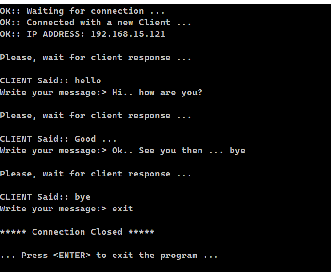
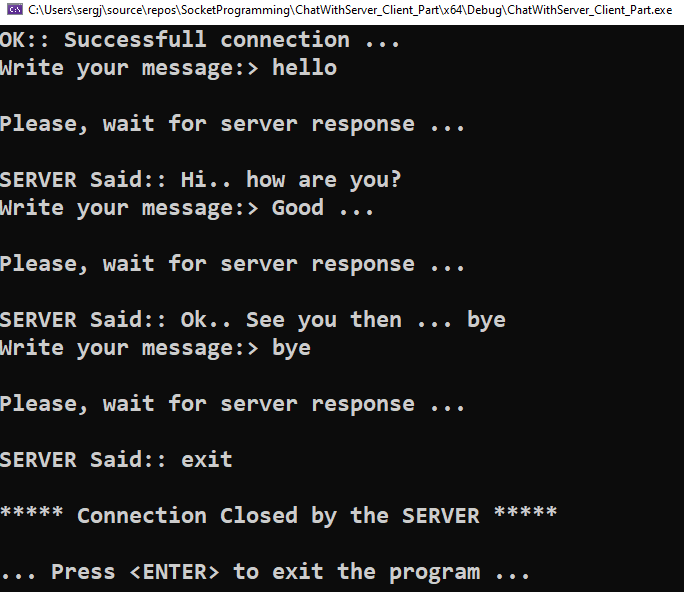

## Simple Client-Server Chat in C++

The primary objective of this project is to establish a basic chat system between a client and a server.
The client initiates a connection to the server using an IP address. Upon receiving a connection request from a client, the server will accept it, and communication between the client and server will take place through a message buffer.

Server Screen          |  Client Screen   
:-------------------------:|:-------------------------:
   |   
